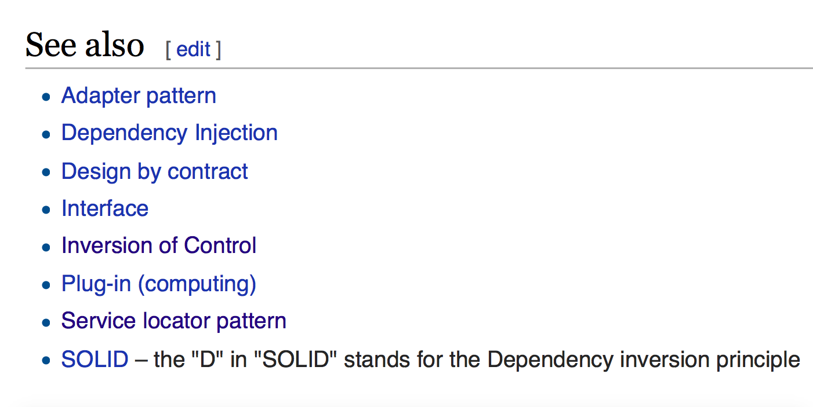

autoscale: true
build-lists: true

# Dependency Injection in Swift

---

# 3 patterns
### (4 actually)

---

#[fit] Constructor injection
<br>
#[fit] Property injection
<br>
#[fit] Method injection

---

# Constructor injection

```swift
public protocol NSCoding {
    public init?(coder aDecoder: NSCoder)
}

class Book: NSObject, NSCoding {
	//decoder is NSKeyedArchiver
	required convenience init?(coder decoder: NSCoder) { ... }
}

class ViewController: UIViewController {
	//decoder is UINibDecoder
    required init?(coder aDecoder: NSCoder) { ... }
}

```

---

# Property injection

```swift
extension UIViewController {
    
    weak public var transitioningDelegate: 
    		UIViewControllerTransitioningDelegate?
}
```

---

# Method injection

```swift

public protocol NSCoding {
    public func encodeWithCoder(aCoder: NSCoder)
}

public protocol UIStateRestoring : NSObjectProtocol {
    
    ...
    optional public func encodeRestorableStateWithCoder(coder: NSCoder)
    optional public func decodeRestorableStateWithCoder(coder: NSCoder)
    ...
}

```

---

# Thank you!

---

# Loose coupling

---

# Loose coupling
# =
# programming to interfaces

---

<br>
##[fit] NSCoder - interface
<br>
##[fit] NSKeyedArchiver - implementation

--- 

# Programming to interfaces 
# =
# depending on interfaces

---

# Dependency Inversion Principle
<br>
>A. High-level modules should not depend on low-level modules. Both should depend on abstractions.
<br>
B. Abstractions should not depend on details. Details should depend on abstractions
<br>
-- [Robert C. Martin "Agile Software Development: Principles, Patterns, and Practices"](http://books.google.com.pr/books/about/Agile_Software_Development.html?id=0HYhAQAAIAAJ&redir_esc=y)

---



---

# DI - IoC for resolving dependencies

---

# DI ? DIP ? IoC

---

# DI ≠ DIP ≠ IoC

---

# DIP - how

^ how my code communicates with other components, using what level of abstraction. Should my class depend on concrete SQL interface or abstract repository. 

---

# DI - where

^ where one object gets its dependencies from, from the inside or from the outside of its own implementation

---

# IoC - who

^ who calls who, who initiate calls and controls the flow - my code asks some library to do something and return result and then I do some logic based on this result, or framework controls the actions flow and asks my code for missing pieces or delegates control at specific points.

---

# Library 
# vs 
# Framework

---

# IoC - UIKit

---

# DIP ≠ DI ≠ IoC

^ they are differen concepts

---

# DIP + DI (+ IoC) = ❤️

^ but upplied together they do good. But it's easy to mess up.

---

# DI + Wrong DIP = 💔

^ Inject dependency with a wrong level of abstraction (low level or no abstraction at all) - and you mess up.

---

# DIP + Wrong DI = 💔

^ Use DIP but use DI in a wrong way (Service Locator) - and you mess up.

---

# DI + DIP (+ IoC) ➡︎ Loose coupling

^ Dependency Injection and Dependency Inversion enables loose coupling

---

# Loose coupling ≠ DI

^ But that does not mean that it is the only way to make you code loosely coupled.

---

# Loose coupling
# ⬇︎
# extensibility

---

# Loose coupling
# ⬇︎
# maintainability

---

# Loose coupling
# ⬇︎
# testability

---

# Loose coupling
# ⬇︎
# parallel development

---

# DI use cases

* Uniform setup
* Composition (over inheritance)
* Interception (decoration)
* Unit tests (esp. in statically typed languages)
* Parallel development
* Layered architecture (VIPER)
* Reusable components
* Application platforms
* ...

---

# Not a use cases

* Prototypes
* Small projets
* No plans to test
* No plans to extend
* No plans to maintain

---

# What to inject?

---

## Volatile dependencies

* Arbitrary implementations (services, repositories (API, data base), delegates, animators, strategies, etc.)
* 3'rd party dependencies (boundaries)
* Mock in tests
* Requires environment setup (data base, key chain, user defaults, etc.)
* Nondeterministic behaviour (random, dates, location,  encryption, networking & communication, etc.)
* Not ready yet (developed in parallel)

---

# What not to inject?

---

## Stable dependencies

* Anything that is not volatile
* Foundation, core libraries (not all)
* Determenistic algorithms
* Something that you never expect to have to replace

---

# What DI is not

---

<br>
#[fit] DI ≠ DI container
<br>
#[fit] DI ≠ Service Locator

---

# DI
# ⬅︎
# Service Locator
# ➡︎

---

# DI container 
# ≠ 
# Service Locator

---

<br>
`|        | No DI Container |   DI Container   |`[^1]
`|:------:|-----------------|------------------|`
`| No DI  | Spaghetti Code  |  Service Locator |`
`|        |                 |                  |`
`|  DI    |  Poor Man's DI  |    Enhanced DI   |`


[^1]: http://www.loosecouplings.com/2011/02/non-di-code-spaghetti-code.html

---

# DI Drawbacks

* Wrong DI - spaghetti code
* Loose coupling drawbacks

---

# DI frameworks
# (DI containers)

---

# Interface Builder

---

# Typhoon
[http://typhoonframework.org](http://typhoonframework.org)

---

# Typhoon + Swift = 💔

Pros:

* Interception
* Storyboards
* Community

Cons:

* Dynamic dispatch
* Wordy API
* Weakly typed
* Not all functions available


---

# Dip

[https://github.com/AliSoftware/Dip](https://github.com/AliSoftware/Dip)

* Constructor, property, method injection
* Three component scopes
* Circular dependencies
* Runtime arguments
* Storyboards integration
* Auto-wiring and Auto-injection
* Named definitions
* Thread safety
* Linux compatible

---

# Links

["Dependency Injection in .Net" Mark Seeman](https://www.manning.com/books/dependency-injection-in-dot-net)
["DIP in the wild"](http://martinfowler.com/articles/dipInTheWild.html)
[Non-DI code == spaghetti code?](http://www.loosecouplings.com/2011/02/non-di-code-spaghetti-code.html)


