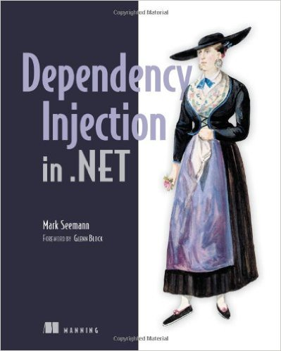
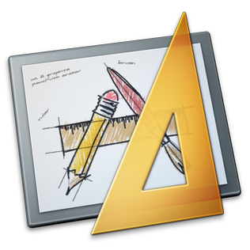

autoscale: true
build-lists: true

# Dependency Injection in Cocoa

^ First of all I would like to say few words about why I think this topic is important.

---

^ The term was used for the first time more than 10 years ago. And it was supposed to help us to write better code.

> #"Inversion of Control Containers and the Dependency Injection pattern"
-- Martin Fowler, 2004

---

^ But we still have to deal with spagetty code. Why do we still write it?


---

^ Because Object Oriented Design is hard.

# Object Oriented Design

---

^ Some of you can argue that there is a functional programming that solves or does not have problems of object oriented programming. And that we need to move in this direction. 

# Functional programming

---

^ Sure! And we are not even first who tries that. And looks like that's a long and not an easy journey. It will be impossible to make it without proper tools. 

# C#, F#, Scala, ...


---

# Objective-C, Swift, Cocoa

^ Yet, our main tools - Objective-C, Swift and Cocoa platform itself are much more Object Oriented than Functional. For that reason most of us will probably continue to write Object Oriented code for some time.

---

^ We need to use these tools properly to write better code. For that there are  design patterns and SOLID principles.

# Design Patterns, SOLID

---

^ Though they are object oriented design patterns and principles, they in fact will help us to make a step further on our way to be more functional.

# SOLID: the next step is Functional[^1]

[^1]: [SOLID: the next step is Functional](http://blog.ploeh.dk/2014/03/10/solid-the-next-step-is-functional/)

---

^ Dependency Injection is a concept that stands very close to SOLID principles. As you will see in a moment it helps a lot to apply them. That's why I think we need to understand and use it. To be able to move forward.

# SOLID + DI = :heart:

---

^ So here is what we are going to talk about today.

* What
* Why
* How
* DI & Cocoa

^ First we will try to understand what is DI, why we need it and how to do it. And in the end we will see what is special there in the Cocoa world.

---

# What
## is dependency injection

^ So what is that, dependency injection?

---

^ Here is what Wikipedia sais:

> In software engineering, dependency injection is a software design pattern that implements inversion of control for resolving dependencies.
-- Wikipedia

---


---

^ Next try.

> Dependency Injection is a set of software design principles and patterns that enable us to develop loosely coupled code.
-- Mark Seemann

---


---
^ Ok, let's make it short: DI is nothing more than a technique that enables loose coupling.

> DI is nothing more than a technique that enables loose coupling
-- Mark Seeman

^ Looks like it's all about loose coupling. But what is that?

---

# Programming to an interface

^ Loose coupling is about programming to an interface, not an implementation.  Programming to implementation is a tight coupling. And tigth coupling is bad. Loose coupling is good. 

^ But what does it all meen for the code?

---


^ Actually nothing as complex as it sounds.

---

^ Here is a very bold example in Objective-C

```objectivec
NSURL *url = [NSURL urlWithString:@"http://api.my.com"];
id<NetworkSession> session = [NSURLSession sharedSession];

// Constructor injection
id<APIClient> apiClient = [APIClientImp alloc] 
	initWithBaseURL:url session:session];

// Property injection
id<Logger> logger = [ConsoleLogger new];
apiClient.logger = logger;

// Method injection
id<Cache> cache = [NSCache new];
[apiClient dupm:cache];
```

^ Here you see three patterns of DI: constructor, property and method injection. Most likely that's what you often do in your daily coding. As it usually happens with patterns - we use them without noticing. 

^ So what's the trick here?

---

^ The trick is that we move the moment when we decide what concrete implementations of abstract dependencies will be used FROM their consumer TO somewhere else. That is the main concept of DI.

#Consumer<br>:arrow_down:<br>Somewhere else

---

^ Usually what we do is this:

```objectivec
@implementation APIClientImp

- (instancetype)init {
	self = [super init];
	if (self != nil) {
		self.session = [NSURLSession sharedSession];
		self.baseURL = [NSURL 
			urlWithString:@"http://api.my.com"];
	}
	return self
}

```
^ Our implementation decides that we will use shared session. When we apply DI this code becomes this:

---

```objectivec
- (instancetype)initWithBaseURL:(NSURL*)url 
						session:(NSURLSession *)session {
	
	self = [super init];
	if (self != nil) {
		self.session = session;
		self.baseURL = url;
	}
	return self
}
```

^ With such interface we force CONSUMERS of that class to provide dependencies. So it's no more api client who decides what session to use.

---

# Single Responsibility Principle

^ Deciding that is a responsibility itself. Doing that inside consumer of the dependency is violation of Single Responsibility Principle. 

---

# Dependency Inversion Principle

^ When we REMOVE this responsibility FROM consumer we, as a next step, can apply Dependency Inversion Principle, making our code to depend on abstractions instead of concretions. So we can have code like this:

---

```objectivec
- (instancetype)initWithBaseURL:(NSURL*)url 
				session:(id<NetworkSession>)session {
						
	self = [super init];
	if (self != nil) {
		self.session = session;
		self.baseURL = url;
	}
	return self
}
```

^ Now instead of dependening on NSURLSession, which is a concretion, we depend on abstraction - some NetworkSession protocol.

---

# Open/Closed Principle

^ And that gives us an opportunity to apply Open/Closed Principle and make our code extended not by changing its source code, but by providing different dependency implementation. 

---

^ Instead of using plain NSURLSession we can use some other implementation, that for example measures each task duration, or logs each request, or even compose different implementations. As long as it conforms to NetworkSession protocol.

```objectivec

id<NetworkSession> urlSession = [NSURLSession sharedSession];

id<NetworkSession> measuringSession = 
	[MeasuringSession sessionWithSession: urlSession];

id<NetworkSession> loggingSession = 
	[LoggingSession sessionWithSession: measuringSession];

id<APIClient> apiClient = 
	[[APIClientImp alloc] initWithBaseURL: url 
								  session: loggingSession];

```

---

# Unit tests

^ We can even have some fake implementation that does nothing and use it in unit tests. For example instead of hitting network our fake implementation of NetworkSession protocol can return some fake data.

---

^ And that is loose coupling in action.

# Loose coupling


---

^ Ok, we know now what DI is and even saw it in code. I think you will agree that it looks very simple. 

^ But despite that simplicity there are several very common misconceptions about DI. And it's important to dispel them.

---

^ So let's shortly talk about what DI is not.

# What DI is _not_


---

# DI is _*not*_ a goal itself,<br>it’s a _*means to an end*_

^ First of all, DI is not a goal itself, it's a means to an end. Depending on what you wish to achieve you can do it by other means than DI. There are other usefull patterns like strategies, factories, or template methods. So if you do DI only for the sake of doing it - you are doing it wrong.

---

# DI is _*not only*_ relevant for unit testing

^ Another popular mistake is to think that DI is ONLY relevant for unit testing. DI enables better testability, but that is NOT all. 

---

# DI is _*not*_ a sort of _*Abstract Factory*_ on steroids

^ Next very common mistake is to think that DI is a sort of Abstract Factory on steroids. Such factory is usually called a Service Locator.

---

^ DI is not about Service Locator. It is about structuring our code in a such way that instead of quering such service for dependencies we force CONSUMERS of our code to supply them. So in fact it is opposite to Service Locator.

# DI ≠ Service Locator

---

^ Apart from Service Locator DI is usually confused with DI framworks or containers. DI frameworks are optional.

# DI _*does not require*_ a DI container

---
^ They can be useful to implement DI but that is just a tool.

# DI ≠ DI container

---

^ Aslo DI container and Service Locator are usually confused. But they are different things. I'm not going to talk about Service Locator today, but we will talk about DI containers shortly. 

# DI container ≠ Service Locator

---

# Why

^ Ok, now we know what DI is and even what it is not. But "why" we need it? What benefits DI and loose coupling brings to our code? Let's go shortly through them one by one. 

---

* Extensibility
* Maintainability
* Testability
* Parallel development
* Modularity

^ First, it makes easier to extend and reuse code even when we don't plan that. 

^ It makes easier to maintain code with clear responsibilities. 

^ It makes easier to unit test code by providing test doubles instead of real implementations. 

^ It makes easier parallel development.

^ It lets you make your code more modular that can also increase code reuse, development speed, build times and so on.

---

# How

^ How to do DI?

---

^ We already saw 3 simple DI patterns. Let's look at them again.

**Constructor Injection**

```objectivec
id<NetworkSession> session = [NSURLSession sharedSession];
id<APIClient> apiClient = [APIClientImp alloc] 
	initWithBaseURL:url session:session];
```

**Property Injection**

```objectivec
id<Logger> logger = [ConsoleLogger new];
apiClient.logger = logger;
```

**Method Injection**

```objectivec
id<Cache> cache = [NSCache new];
[apiClient dupm:cache];
```

---

^ But how we setup the dependencies of our component? The simplest answer is to use some kind of abstract factory.

```objectivec
- (id<APIClient>)resolveAPIClient {

  id<NetworkSession> session = [NSURLSession sharedSession];
  id<APIClient> apiClient = [APIClientImp alloc] 
	initWithBaseURL:url session:session];
	
  id<Logger> logger = [ConsoleLogger new];
  apiClient.logger = logger;
  
  return apiClient
}
```

---

# Poor Man's DI

^ That is called Poor Mans DI. It does not require anything but structuring your code properly and use common patterns like factories and decorators. 

---

# TODO

^ But there are still a lot of things to know about how to do it right, like what dependencies should be injected and what not, what is a composition root, what are DI antipatterns and how to refoctor code to use DI.

- Volatile  vs Stable dependencies
- Composition root
- DI antipatterns
- refactoring
- ...

---

^ If you are interested - read this book. There will be link again in the end.

##[Dependency Injection in .NET](https://www.manning.com/books/dependency-injection-in-dot-net)
### Mark Seemann



---

^ But now I want to talk more about code and about another interesting aspect of how to do DI. DI containers.


# DI containers


^ Basically DI container is a component that is responsible for creating dependencies graph and managing their life cycle. As we are Cocoa developers, let's talk specifically about DI containers in Cocoa.

---

# Objective-C vs Swift

^ In Cocoa we have two options to choose a language - Objective-C and Swift. 

---

# *Dynamic* vs *Static*<br>dispatch

^ And two runtimes, or better to say dynamic or static dispatch. Few of DI containers features requrie a more flexible runtime. For that Objective-C suites better, and in Swift they are more or less impossible.

---

^ Depending on how you choose to build your app, you have different options of DI containers. For example for Objective-C


---
^ or for Swift. 


^ They offer different API's and set of features. On these screenshots you can see that there are quite few containers available, even for Swift.

---

^ But there is one that we all use or at least heard of. Guest what?

---

# Interface Builder[^2]



^ Interface Builder. But I'm not going to talk about that.

[^2]: Apple Inc.

---

^ To make a quick overview I will use Typhoon for Objective-C and Dip for Swift.

#[fit] Typhoon (Objective-C)<br/>vs<br/>Dip (Swift)

---

# Typhoon
### [http://typhoonframework.org](http://typhoonframework.org)

^ Let's kick of with Typhoon and some of it's stats.

Current version: 3.4.5
Watchers: 87
Contributors: 44
Stars: ~1700
Forks: 177
Commits: ~2700
Files: 208
Lines of Code: ~7500
Downloads: ~300,000
Installs: ~1800
Language: Objective-C, Swift

^ As you can see it's a pretty popular library that you can use both in Objective-C and Swift. And also pretty big one.

---

^ So get ready.


---

^ Main Typhoon building blocks are `TyphoonAssembly` and `TyphoonDefinition`. 

# `TyphoonAssembly`
# `TyphoonDefinition`

---

^ Here is a simple example. First you define a `TyphoonAssembly` and components that it provides.

```objectivec

@interface APIClientAssembly: TyphoonAssembly

- (id<APIClient>)apiClient;

- (id<NetworkSession>)defaultSession;

- (id<Logger>)defaultLogger;

@end

```

---

^ Then you create it's implementation:

```objectivec

- (id<APIClient>)apiClient {
	return [TyphoonDefinition withClass:[APIClientImp class] 
					    configuration:^(TyphoonDefinition* definition) {
	
		[definition useInitializer:@selector(initWithBaseURL:session:)
		 				parameters:^(TyphoonMethod *initializer) {
		 				
         	[initializer injectParameterWith:TyphoonConfig(@"baseUrl")];
			[initializer injectParameterWith:[self defaultSession]];
			
		}];
			
		[definition injectProperty:@selector(logger) 
							with:[self defaultLogger]];
	}];
}
...

```
^ Here instead of creating concrete instance of `APIClientImp` class that implements `APIClient` protocol we create a `TyphoonDefinition` that describes how that instance should be created when it is requested, like what initialiser shoud be used and with what perameters. 

^ Also we specify that upon instantiation Typhoon should inject property `logger` in created instance. This property and initialiser arguments are also served by the same assembly.

---

^ Here are their definitions:

^ Session definition is very simple. Typhoon will just use it's shared instance. 

```objectivec
...

- (id<NetworkSession>)defaultSession {
	return [TyphoonDefinition withClass:[NSURLSession class] 
			configuration:^(TyphoonDefinition* definition) {
			
		[definition useInitializer:@selector("sharedSession")];
		
	}];
}

...

```

---

^ Logger will be created with default `init` initialiser and we specify that it's definition has a singleton scope. That means that once created instance will be reused every time a logger is requested. 

```objectivec
...

- (id<Logger>)defaultLogger {
	return [TyphoonDefinition withClass:[ConsoleLogger class] 
				configuration:^(TyphoonDefinition *definition) {
				
		definition.scope = TyphoonScopeSingleton;
		
	}];
}

...

```
---

^ And here is how you use it in code:

```objectivec
APIClientAssembly *assembly = 
	[[APIClientAssembly new] activate];
	
id<APIClient> apiClient = [assembly apiClient];
```

^ First you create an assembly and activate it. After that its methods will return not `TyphoonDefinition`s but instances, created based on these definitions. For this magic to work Typhoon relies a lot on Objective-C runtime. I mean "A LOT"!

---

^ This was a very basic example that demonstrates only the small subset of Typhoon features.

* Initialiser, property and method injection, injection with configurations
* Runtime arguments and circular dependencies
* Five different scopes (life cycle strategies)
* Storyboards integration
* Abstract and Base Definitions
* Injection callbacks
* Auto-wiring and auto-injection
* Modularized assemblies
* Option matchers, post processors, type converters, patchers

---

^ As you will probably agree the API looks very natural for Objective-C. Wordy as usual.

# Objective-C :thumbsup:

^ But what about Swift?

---

^ In Swift it looks pretty the same. Here is for example the definition for api client and it's usage.

```swift

public class APIClientAssembly: TyphoonAssembly {

	public dynamic func apiClient() -> AnyObject {
		return TyphoonDefinition.withClass(APIClientImp.self) { 
			definition in
			
			definition.useInitializer(Selector("initWithBaseURL:session:")) { 
				initializer in 
			
				initializer.injectParameterWith(TyphoonConfig("baseUrl"))
				initializer.injectParameterWith(self.defaultSession())
			
			}
			definition.injectProperty("logger")
		}
	}
	
}

let assembly = APIClientAssembly().activate()
let apiClient = assembly.apiClient() as! APIClient
```

^ That will work but it does not feel good for Swift at all. You may notice the use of AnyObject, force type casting, dynamic methods and selectors.

---

#Swift :thumbsdown:

^ There is a major drawback in using Typhoon in Swift code base. It requires Objective-C runtime. You are not able to directly use it with pure Swift types. 

---

# NSObject<br>@objc

^ You will need to subsclass from NSObject and make your protocols compatible with Objective-C, or use some tricks. If it's not a problem - Typhoon is a good choise. Aslo they are going to release new registration syntax that will make it better in Swift.

---

#Swift :cry:

^ But what if you wish to work with pure Swift types?

---

# Dip
### [https://github.com/AliSoftware/Dip](https://github.com/AliSoftware/Dip)

^ For that there is Dip. Let's see what it has to offer us. Here are some stats again:

Current version: 4.2.0
Watchers: 8
Contributors: 2
Stars: ~160
Forks: 6
Commits: ~200
Files: 5
Lines of Code: 403
Downloads: ~1500
Installs: ~50
Language: Swift

---

^ Let's see how the same example will look like if we use Dip.

```swift
let container = DependencyContainer() { container in
	
	container.register { 
		try APIClientImp(
			baseURL: container.resolve(tag: "baseUrl"), 
			session: container.resolve()
		) as APIClient }
	.resolveDependencies { container, client in
		client.logger = try container.resolve()
	}
	
	container.register { NSURLSession.sharedSession() as NetworkSession }
	
	container.register(.Singleton) { ConsoleLogger() as Logger }
	
	/* Getting baseUrl from config file scipped for breavity */
}

let apiClient = try! container.resolve() as APIClient

```

^ In Dip we create a DependencyContainer and register our components in it using closures. To get the instance of some type we resolve it using container. I hope you will agree that it looks better in Swift. Also Dip uses more canonical "register-resolve" API pattern, than Typhoon, which API is based on factory methods.

---

^ Here are some of the features that Dip provides.

* Constructor, property, method injection
* Three component scopes
* Circular dependencies
* Runtime arguments
* Storyboards integration
* Auto-wiring and Auto-injection
* Named definitions
* Thread safety
* Linux compatible

---

^ To wrap up here is a table that compares list of Typhoon and Dip features. You can see that they both implement all basic container features. So it's really up to you to decide which of them to use, if you ever decide to use any container.


											Typhoon 	Dip
											
	Constructor, property, method injection    ✔︎ 		 ✔︎
	Lifecycle management    				   ✔︎ 		 ✔︎
	Circular dependencies					   ✔︎ 		 ✔︎
	Runtime arguments						   ✔︎ 		 ✔︎
	Named definitions						   ✔︎ 		 ✔︎
	Storyboards integration					   ✔︎ 		 ✔︎
	-----------------------------------------------------------
	Auto-injection							   ✔︎ 		 ✔︎
	Auto-wiring								  ✔︎/✘ 	  ✔︎/✘
	Thread safety							   ✘	   	  ✔︎
	Interception							   ✔︎ 		 ✘
	Infrastructure							   ✔︎ 		 ✘
	Platforms								  Apple		Apple/Linux
	Languages							   ObjC/Swift  	Swift

---

^ Remember that DI does not requre DI container. And of course you should not start using DI by introducing a container to your code.

# DI ≠ DI container

---

^ There are some cases where DI container make more sense. But probably all that you need is Poor man's DI.

# Poor Man's DI

---

^ As a post scriptum here are some more good words about DI:

> #“Dependency Injection” is a 25-dollar term for a 5-cent concept.[^3]
-- James Shore

[^3]: [Dependency Injection Demystified](http://www.jamesshore.com/Blog/Dependency-Injection-Demystified.html)

---

# Links

* Books:
	* ["Dependency Injection in .Net" Mark Seeman](https://www.manning.com/books/dependency-injection-in-dot-net)
* Blogs:
	* [Mark Seeman's blog](http://blog.ploeh.dk/tags/#Dependency%20Injection-ref)	 
	* [Martin Fowler: Inversion of Control Containers and the Dependency Injection pattern](http://martinfowler.com/articles/injection.html#InversionOfControl)
	* [IoC container solves a problem you might not have but it’s a nice problem to have](http://kozmic.net/2012/10/23/ioc-container-solves-a-problem-you-might-not-have-but-its-a-nice-problem-to-have/)
	* [objc.io Issue 15: Testing. Dependency Injection, by Jon Reid](https://www.objc.io/issues/15-testing/dependency-injection/)
	* [Dependency injection with Dip](http://ilya.puchka.me/dependency-injecinjection-with-dip/)
	* [Dependency Inversion Principle and iPhone](https://blog.8thlight.com/eric-smith/2009/04/16/dependency-inversion-principle-and-iphone.html)
* Code:
	* [Typhoon](https://github.com/appsquickly/Typhoon)
	* [Dip](https://github.com/AliSoftware/Dip)
* [This talk's script and code samples](https://github.com/ilyapuchka/Dependency-Injection-in-Cocoa)

---

# Thank you!

---

# Questions?

### [How to explain dependency injection to a 5-year old?](http://stackoverflow.com/a/1638961/1379226)

## [@ilyapuchka](https://twitter.com/ilyapuchka)
## [github.com/ilyapuchka](https://github.com/ilyapuchka)
## [ilya.puchka.me](http://ilya.puchka.me)


