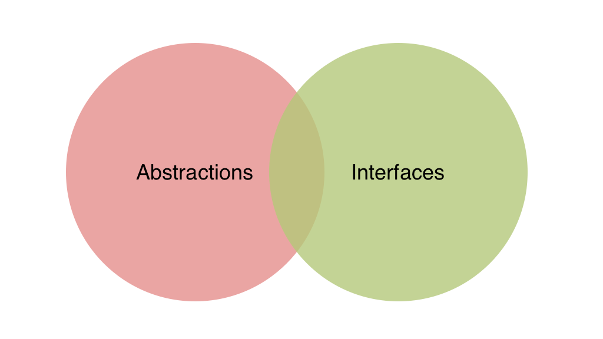
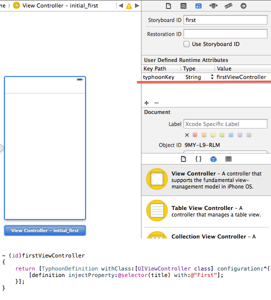
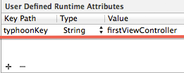

# Ilya Puchka
## Sr. iOS developer 
## @ HelloFresh
### [http://ilya.puchka.me](http://ilya.puchka.me)<br><br><br>
## Dependency Injection in Swift

^ Hi everyone. My name is Ilya. I'm working as iOS developer here in Berlin at company called HelloFresh.
And, of course, we have an iOS app. Since day one it was a pure Swift app.

---

## Swift<br><br>
### Functional<br>or<br>object oriented?

^ For many of us Swift opened up a brand new world of functional programming. But it is still much more object oriented language than functional. And our main tools - Cocoa frameworks are not functional at all. So probably we will still keep writing object oriented code. And the problem is that it is actaully hard to write well designed object oriented code.

---

## SOLID KISS DRY YAGNI RAP CQS DECORATOR FACADE ABSTRACT FACTORY STRATEGY ...

^ There are bunch of different design principles, like SOLID, and even more design patterns. Just the fact that there are so many different principles and patterns indicates that good object oriented design is hard, if ever possible.

---

# DI  SOLID

^ Dependency Injection which I'm going to talk about today is itself not a part of SOLID principles that I have just mentioned. But it strongly relates to all of them. 

---

## What is Dependency Injection?

^ Unfortunatelly the concept of Dependency Injection is surrounded with many misconceptions. 

---

^ For example, Wikipedia gives us very complex and obscure definition.

> In software engineering, dependency injection is a software design pattern that implements inversion of control for resolving dependencies.
-- Wikipedia

---

^ In contrast some developers say that

> “Dependency injection is really just passing in an instance variable.
-- James Shore

---

### Voodo magic
### Slow frameworks
### Only for testing
### Overengineering

^ Others still think that it is some kind of voodoo magic that requires to use complicated and slow frameworks, or that it is only relevant for testing and just makes code harder to understand.

^ I would say that all of these are misconceptions about Dependency Injection.

---

## What is Dependency Injection?

^ Today I will try to make it more clear, as far as I can, and present what I think is Dependency Injection. I will try to show you how to do Dependency Injection. More than that we will discuss how we should not do it.

^ So what is Dependency Injection?

---

## First step - 
## passing instance variables

^ It is true that in its essence Dependency Injection is just about passing instance variables. This is the first step and as each first step it is the most important one. But that is only one part of a story.

---

## Second step - ?
## Third step - ?

^ There are also a second and even a third step. And these steps make the difference between just passing variables and Dependency Injection. Today we will talk about all of theses steps.

---

# Why Dependency Injection?

^ To start let's see what problems Dependency Injection tries to solve in the first place.

---

## Abstractions everywhere

^ In programming we always have to deal with abstractions of different kinds and levels. They are just everywhere. Interfaces, methods, closures and even concrete types and variables names - they are all abstractions. Just with different level of concrete details. 

---

^ For a good code design it's very important to use proper abstractions because they make our code loosely coupled. 

^ That means that different componenets of our code can be replaced with alternative implementations without affecting other components.

## Loose Coupling

---

###[fit] test
###[fit] extend and reuse
###[fit] develop in paraller
###[fit] maintain

^ When your code is loosely coupled it becomes easier to test, easier to extend, easier to reuse, easier to develop in parallel.

^ That all makes it easier to maintain. 

---

## DI enables loose coupling

^ Loosely coupled code is the main goal of Dependency Injection. It enables us to write loosely coupled code. And thus it makes testing, extending and reusing code easier. 

---

##[fit] DI - not just unit tests

^ Very often Dependency Injection is discussed only in context of Unit Testing. You probably already heard some talks or read some articles which describe how it improves testability, especially in Swift.

^ But the real picture is much wider. If your final goal is not just unit testing some classes but loose coupling you will need to make a bit more effort.

---

^ So how we do dependency injection? There are few patterns. Constructor, property, method injection and ambient context.

## Patterns
##<br>
### Custructor Injection
### Property Injection
### Method Injection
### Ambient context

^ Let's see how they look like using various examples from Cocoa frameworks.

---

# Constructor injection

^ Constructor injection is not widely used in Cocoa, but here is an example from CoreData:

```swift
class NSPersistentStore : NSObject {
	init(
		persistentStoreCoordinator root: NSPersistentStoreCoordinator?, 
		configurationName name: String?, 
		URL url: NSURL, 
		options: [NSObject : AnyObject]?)
		
	var persistentStoreCoordinator: NSPersistentStoreCoordinator? { get }
}
```

^ Here the instance of persistent store coordinator is passed in constructor of `NSPersistentStore` along with some other parameters. Then reference to coordinator is stored and can not be changed in runtime. 

---

## Easy to implement
## Immutability

^ Though there are not so many examples of constructor injection in Cocoa frameworks, it should be your prefered way to inject dependencies. Because it's the easiest one to implement, it ensures that dependencies will be always present and that they will not change at runtime what makes it much safer.

^ But there are cases when constructor injection is not possible or does not fit well. In that case you should use property injection.

---

# Property injection

^ This pattern is all over the place in any iOS application. For example delegate pattern is often implemented using property injection. So you should be already familiar with it.

```swift
extension UIViewController {
    weak public var transitioningDelegate: 
    		UIViewControllerTransitioningDelegate?
}
```

^ Here for example view controller exposes writable property for transitioning delegate that we can change at any moment if we want to override the dafault behavior.

^ When should we use this pattern?

---

## Local default
## Foreign default

^ Property injection should be used when there is a good local default for dependency. That means that implementation is defined in the same module (framework or library). `nil` is also a perfect local default, it just makes dependency optional. 

^ But if dependency comes from a separate framework then it is a foreign default and you should use constructor injection.

^ Imagine that default implementation of transitioning delegate is defined not in UIKit, but in some other framework. Then you will always need to link to this framework even if you never use this API. UIKit becomes tightly coupled with that framework. And it drags along this unneded dependency. The same can happen with your own code and that will make it harder to reuse.

---

## Optionals
## Not immutable
## Thread safety

^ Comparing with constructor injection property injection is easier to understand and it makes our API to look more flexible. But at the same time it can be harder to implement and can make our code more fragile. 

^ First of all you need to have some default implementation in place or handle optional value in a proper way. 

^ Secondly, you can not make your property immutable and will need to ensure immutability at runtime instead of compile time.

^ Also you may need to synchronise access to it to prevent threading issues.

^ For these reasons if you can use constructor injection prefer it over property injection. 

---

# Method injection

^ Next pattern, method injection is as simple as passing argument to a method. For example here is NSCoding protocol:

```swift
public protocol NSCoding {
    public func encodeWithCoder(aCoder: NSCoder)
}
```

^ Each time the method is called different instance and even implementation of `NSCoder` can be passed as an argument.

^ Method injection is usually used when dependency can vary with each method call or when dependency is temporal and it is not required to keep reference to it outside of a method scope. 

---

# Ambient context

```swift
public class NSURLCache : NSObject {

	public class func setSharedURLCache(cache: NSURLCache)
	
	public class func sharedURLCache() -> NSURLCache
	
}
```

^ The last pattern - ambient context - is hard to find in Cocoa. Probably NSURLCache is the most close example. It is implemented using some static method or property. But you should not mix it with a singleton pattern, because this property should be writable so that clients can change it in runtime.

---

^ This pattern may be used only for truly universal dependencies that represent some cross-cutting concerns such as logging, analitycs, accessing time and dates.

# Cross-cutting concerns

- logging
- analitycs
- time/date
- etc.

---

^ Ambient context has its own advantges. It makes dependency always accessible and does not pollute API. But most of the time it does not justify its disadvantages. It makes dependency implicit and it represents a global mutable state which is bad. So first you should consider using other DI patterns and use ambient context as a last resort.

### Pros:

- does not pollute api
- always available

### Cons:

- implicit dependency
- global mutable state

---

# Separation of concerns

- what concrete implementations to use
- configure dependencies
- manage dependencies' lifetime

^ As you may notice all these patterns are very simple and they share one common principle - separation of concerns.

^ We remove several responsibilities from the consumer of dependency: what concrete implementation to use, how to configure it and how to manage its lifetime.

^ This lets us easily substitute dependency in different context or in tests, change its lifetime strategy, for instance use shared or separate instances, or to change the way how the dependency is constructed. All without changing its consumers. 

^ That makes concumer decoupled with its dependencies, making it easier to test, reuse and extend.

---

## Where dependencies are created?

^ The obvious side effect of these patterns is that now every user of our code needs to provide its depnendecies. But how do they get them? 

^ If they create them directly then they become tigthly coupled with those dependencies. So we just move the problem to another place.

---

# Composition root

^ That problem brings us to much less dicussed DI pattern called Composition Root. 

^ Composition Root is a place where components from different layers of your application are wired together. The main point of having composition root is to separate configuration logic from the rest of your code, do it in a well defined place in a common manner. Having a piece of code which single responsobility is to configure other components. 

^ Creating dependencies and injecting them in constructors or properties should be done only in the Composition Root.

---

```
			^					+------------------+
			|					| App Entry  Point |
			|					|                  |
			|					| Composition Root |
			|					+------------------+
  			|				   +--------------------+
			|				   |                    |
			L				   | Presentation Logic |
			A				   |                    |
			Y				   +--------------------+
			E					  +--------------+
			R					  |              |
			S					  | Domain Model |
			|					  |              |
			|					  +--------------+
			|					  +--------------+
			|					  |              |
			|					  | Data  Access |
			|					  |              |
			v					  +--------------+

```

^ Ideally there should be one Composition Root in the application and it should be close to application entry point. Like on this diagram.

^ But it does not have to be implemented with a single method or a class. It can contain as many classes and methods as needed until they stay together at the same layer of components.

---

## VIPER example

^ Here is for example implementation of Composition Root from VIPER example application:

```swift
func configureDependencies() {
    // Root Level Classes
    let coreDataStore = CoreDataStore()
    let clock = DeviceClock()
    let rootWireframe = RootWireframe()
    
    // List Module Classes
    let listPresenter = ListPresenter()
    let listDataManager = ListDataManager()
    let listInteractor = ListInteractor(dataManager: listDataManager, clock: clock)
	...    
    listInteractor.output = listPresenter
    listPresenter.listInteractor = listInteractor
    listPresenter.listWireframe = listWireframe
    listWireframe.addWireframe = addWireframe
    listWireframe.listPresenter = listPresenter
    listWireframe.rootWireframe = rootWireframe
    listDataManager.coreDataStore = coreDataStore
    ...
}
``` 

^ Here we have some root classes, root wireframe that only manages window root view controller and a separate components for some list of todo items. Then we just wire them all together. And it is all implemented in one class.

---

## VIPER example

^ And the only place where we use this class is the app delegate:

```swift
@UIApplicationMain
class AppDelegate: UIResponder, UIApplicationDelegate {
    var window: UIWindow?
    
    let appDependencies = AppDependencies()

    func application(
    	application: UIApplication, 
    	didFinishLaunchingWithOptions launchOptions: [NSObject : AnyObject]?) -> Bool {
        
        appDependencies.installRootViewControllerIntoWindow(window!)
        
        return true
    }
}
```
---

^ Unfortunatelly Composition Root is usually not discussed in articles or talks about DI. But it is probably one of the most important parts of Dependency Injection. And getting all classes with dependencies moved to Composition Root is the biggest challenge of properly implementing DI. Especially in a large code base.

> The biggest challange of properly implementing DI is getting all classes with dependencies moved to Composition Root
> -- Mark Seeman

^ If we manage to do that we have already come a long way.

---

# Anti-patterns

^ But as it often happens while we are trying to properly implement some patterns we can easily end up with anti-patterns.

^ So, now let's move on to the dark side and see what are the common DI anti-patterns.

---

## Control freak

^ The first one is control freak. That is simply when you don't use DI at all. When consumer of dependency controls how and when the dependency is created. It happens every time when consumer gets a dependency directly or indirectly using constructor anywhere outside Composition Root. For example in its own constrcutor or just when it needs it.

```swift
class RecipesService {

    private let repository: RecipesRepository
    
    init() {
        self.repository = CoreDataRecipesRepository()
    }
}

```

---

## ~~`init()`~~

^ But does that mean that we are not allowed to use constructors at all? Of course not. It depends on what kind of dependency we construct. 

---

## Stable 
## Volatile

^ There are two kinds of them - stable and volatile. When it comes to stable dependencies you should not worry about constructing them directly inside their consumer. But you should avoid doing that for volataile dependencies.

---

## Stable?

^ What can be considered as a stable dependency? With some exceptions most of foundation and core libraries are stable dependencies. Dependencies that implemented determenistic algorithms are stable. If you never expect to replace dependency or never expect breaking changes in it - it is stable (though it is hard to say never). And simply any dependency which is not volatile is stable.

- foundation and core libraries (with exceptions)
- never expect to replace
- no breaking changes in new versions
- determenistic algorithms
- not volatile

---

## Volatile?

^ What is a volatile dependency then? Any dependency that requires some specific environment setup, like database or network access. Dependencies that implement nondetermenistic behaviour, for example use random numbers, depend on time or implement cryptography are volatile. When you expect dependency to be replaced, for example with fake implementation in unit tests, it is volatile. And if you develop in parallel and dependency is simply not ready yet - it is also volatile.

- dependency requires environment configuration (data base, networking, file system)
- nondetermenistic behavior (dates, cryptography)
- expected to be replaced (unit tests)
- dependency is still in development

---

## Volatile dependencies disable loose coupling

^ The symptom of volatile dependencies is that they disable some of loose coupling benefits. If dependency does not let you test, extend, reuse or develop your code in parallel - it should be considered as volatile.

^ So first of all you need understand if the dependency is volatile or stable and inject it with Dependency Injection patterns when it is volatile.

---

# Bastard injection

^ The next anti-pattern is called Bastard injection. That happens when you have constructor that lets you provide dependencies for tests and another constructor with default dependencies used in production. 

^ In Swift we can do that easily with default arguments like in the following example.

```swift
class RecipesService {

    private let repository: RecipesRepository
    
    init(repository: RecipesRepository = CoreDataRecipesRepository()) {
        self.repository = repository
    }
}

```
---

## Foreign default

^ The problem of this anti-pattern is in using as a default a foreign default - defined in other module. Yes, we improve testability but at the same time we can break modularity because of tight coupling. 

^ If default implementation is local the impact of this anti-pattern is much smaller. Maybe it will be better to refactor it to property injection instead. 

^ But when default implementation is foreign - use standard constructor injection and do not provide default value for this argument. Instead provide it in Composition Root. This way you don't loose any flexibility but avoid tight coupling with another module.

---

# Service locator

^ The last anti-pattern I will talk about is a Service Locator.

^ Service Locator is a common name for some service that you can query for different objects that were previously registered in it. 

^ It is the most tricky anti-pattern because it can make you feel that everything is absolutely fine. And many developers do not consider it as an anti-pattern. But Service Locator is in fact oposite to Dependency injection.

---

^ Let's look at an example:

```swift
let locator = ServiceLocator.sharedInstance
locator.register( { CoreDataRecipesRepository() }, 
				 	forType: RecipesRepository.self)

class RecipesService {

    private let repository: RecipesRepository
    
	init() {
		let locator = ServiceLocator.sharedInstance
		self.repository = locator.resolve(RecipesRepository.self)
    }
}

```

^ In this example we have some service where we first register some factory and then ask this service for our dependency when we need it instead of using constructor or property injection.

---

^ It seems like Service Locator provides all the benefits of Dependency Injection. It improves extensibility and testability because we can register another implementation of dependency without changing its consumer. It separates configuration from usage and also enables parallel development. 

Pros:

- Extensibility
- Testability
- Parallel development
- Separation of concerns

---

Cons:

- Implicit dependencies
- Hidden complexity
- Tight coupling
- Not reusable
- Less maintainable

^ But it has few major drawbacks. It makes dependencies implicit instead of explicit what hides real class complexity. To be able to use this class we need to know its internal details. 

^ We don't see its dependencies and will find out about them only at runtime or by inspecting its implementation. Also with service locator our code becomes tightly coupled with it.

^ That completely breaks reusability and makes code less maintainable. For these reasons I tend to think about Service Locator as an anti-pattern.

---

- DI enables loose coupling and maintainability
- 4 patterns, prefer constructor injection
- Use local defaults, not foreign
- Inject volatile dependencies, not stable
- Avoid anti-patterns

^ So lets sum up what we have discussed by that point. We discussed that Dependency Injection is used to enable loose coupling what makes our code easier to maintain. 

^ We discussed different DI patterns among which constructor injection should be a prefered choise. 

^ We discussed what are local and foreign dependencies and what are stable and volatile dependencies. 

^ Also we discussed what are common DI anti-patterns that we should avoid.

---

## Dependency injection - passing instance variables?

^ This all was what some developers call "passing instance variables". But as we saw it is a bit more than that. 

^ At this point using DI patterns we've made our dependencies explicit and moved all the configurations in the Composition Root which is already a huge step forward to our goal - loose coupling.

---

## Second step - abstractions

^ The next big step towards loose coupling is to model dependencies with abstractions. 

--- 

## Dependency Inversion Principle (DIP)

^ If you remember SOLID principles then you probably remember the last of them - Dependency Inversion Principle. It says that high-level code should not depend on lower-level code, they both should depend on abstractions and these abstractions should not depend on details.

---

^ The point is that the class and its dependency should be on the same level of abstraction. If we have some service it should not depend on concrete API repository or data base repository because they belong to lower level layer. 

^ For example we should not depend on API repository implemented with Alamofire or data base repository implemented with CoreData or Realm.

```
						|	
		 High level		|			 Low level
						|
		+---------+ 	|     +---------------------+ 
		|         | 	|     |                     | 
		| Service |  ------>  | Concrete Repository |
		|         | 	|     |                     |  
		+---------+ 	|     +---------------------+
						|
						|
						|

```

---

^ Instead we should depend on a higher level abstraction. Both service and repository should depend on that abstraction. So the direction of dependency between higher and lower levels is inverted.

```
											|
				High level					|		   Low level
											|
											|
+---------+      +---------------------+    |    +---------------------+ 
|         |      |                     |    |    |                     |
| Service | ---> | Abstract Repository | <-----  | Concrete Repository |
|         |      |                     |    |    |                     |
+---------+      +---------------------+    |    +---------------------+ 
										   	|
										   	|
										 	|

```

---

^ And we should follow this principle to have loosly coupled code. And Dependency Injection is not just patterns that we discussed before. It requires both patterns and Dependency Inversion Principle to be applied at the same time. Without that we will not get all the benefits of loose coupling.

##[fit] DI = DI patterns + DIP

---

^ It is commonnly said that loose coupling is achieved by programming against interfaces.

> Program to an interface, not an implementation
> -- Design Patterns: Elements of Reusable Object-Oriented Software

---

## Program to an ~~interface~~ abstraction

^ But Dependency Inversion Principle says that it is not about interfaces, but about abstractions. Loose coupling does not mean interfaces or protocols everywhere. Because not always interfaces are good and reusable abstractions.

---

^ Interface (or a protocol) is just a language construct that you can use to model abstraction. But it does not make any guarnatee for a good abstraction. Base class can be sometimes as good as an interface.

## Interfaces are not abstractions [^1]



[^1]: [http://blog.ploeh.dk/2010/12/02/Interfacesarenotabstractions/](http://blog.ploeh.dk/2010/12/02/Interfacesarenotabstractions/)

---

##[fit] DI = DI patterns + DIP

^ So Dependency Injection and Loose Coupling is achieved not just with Dependency Injection Patterns but also with Dependency Inversion Principle. 

^ But there is also one more step that we can make using another design principle.

---

## Third step -
## Inversion of Control

^ This principle is called Inversion of Control. It is often seen as a defining characteristic of frameworks. When we use libraries the flow is "normal" and we call library from our code. But in case of frameworks it is inverted - framework calls our code using different callback methods. 

^ And we can apply this principle in context of managing dependencies using special frameworks.

---

# DI Containers


^ Usually these frameworks are called Dependency Injection Containers.

^ There are bunch of different containers available. Maybe even too many of them already. Just go to CocoaPods page and search for "dependency injection". You will find a lot of different frameworks but you will notice that only few of them succeeded and became relatively popular.

---

## Typhoon
## Dip

^ Let's shortly look at two of them - one that comes from Objective-C world and one from Swift. Typhoon and Dip. 

---

## Typhoon

[http://typhoonframework.org](http://typhoonframework.org)


^ First one, Typhoon, is probably the most popular DI container among Cocoa developers.

<br>

- a lot of features
- good docs
- well maintained
- continuously improved

^ It has relatively simple and well documented API with lots of powerfull features. It is well maintained and supported and still continues to improve.

---

^ In terms of API Typhoon building blocks are object called assemblies. Here is an example of such assembly interface. It looks like a simple factory.

```swift
public class APIClientAssembly: TyphoonAssembly {
    
    public dynamic func apiClient() -> AnyObject { 
	    ... 
    }
    
    public dynamic func session() -> AnyObject { 
	    ... 
    }
    
    public dynamic func logger() -> AnyObject { 
	    ... 
    }
    
}
```

---

^ But in implementation instead of returning a concrete instance of some type like from factory method we return a `TyphoonDefinition` that describes how that instance should be created when it is requested. What initialiser shoud be used and with what perameters, what properties should be injected. We can also define different scopes or lifetime strategies. For example Singleton scope will create only one instance of logger.

```swift
public dynamic func apiClient() -> AnyObject {
    return TyphoonDefinition.withClass(APIClientImp.self) { definition in
        
        definition.useInitializer(#selector(APIClientImp.init(session:))) {
            initializer in
            
            initializer.injectParameterWith(self.session())
        }
        
        definition.injectProperty("logger", with: self.logger())
    }
}

public dynamic func session() -> AnyObject {
    return TyphoonDefinition.withClass(NSURLSession.self) { definition in
        definition.useInitializer(#selector(NSURLSession.sharedSession))
    }
}
    
public dynamic func logger() -> AnyObject {
    return TyphoonDefinition.withClass(ConsoleLogger.self) { definition in
        definition.scope = .Singleton
    }
}

```
---

^ To get an instance of some type from assembly we first activate it and then just call its interfce method. When activated assembly methods will return not `TyphoonDefinition`s but instances, created based on the rules that we provided.

```swift
let assembly = APIClientAssembly().activate()

let apiClient = assembly.apiClient() as! APIClient
```

---

<!--
## Wireframe (VIPER) =
## Assembly + Router

^ Of course if you use DI framework you should reference it only from Composition Root.

^ With Typhoon if you create controllers in code you can work with assemblies like with VIPER Wireframes that I mentioned before. 

^ In this case you will actually break wireframe in two components - assembly which will be responsible for configuration and router which will be responsible for navigation.

---

## Storyboards integration

^ If you use Storyboards then Thyphoon integrates with them using a similar pattern of user-defined attribute that I also described before. You just need to set a special flag on your view controllers and Typhoon will be able to inject thier dependencies.

 

---

-->

## Typhoon + Swift 🤔

^ To make this work Typhoon uses Objective-C runtime a lot. And in Swift applications using Objective-C runtime looks just not right.

^ You still can use Typhoon in Swift as well as in Objective-C. But there are some problems you will face with:

- Requires to subclass NSObject and define protocols with `@objc`
- Methods called on injection should be `dynamic`
- requires type casting
- not all features work in Swift
- too wordy API for Swift

^ So I personally would not use Typhoon in its current state in a pure Swift code base. Especially when there are already few native solutions.

---

## Dip

[https://github.com/AliSoftware/Dip](https://github.com/AliSoftware/Dip)

^ And Dip is one of them. You can use it only in Swift and it does not require Objective-C runtime at all. In fact it even does not have any references to Foundation, so you can use it on any platform where you can use Swift. It is also type-safe and implementation is not that complicated comparing with Typhoon. 

<br>

- pure Swift api
- cross-platform
- type-safe
- small code base

^ In terms of API it takes approach that is more traditional for DI containers on other platforms and follows "register-resolve" pattern.

---

## Register

^ Here is the same example that we used for Typhoon. First we register `APIClientImp` as implementation of `APIClient` protocol. Container will also resolve contructor argument and when instance is created will set its `logger` property which will be resolved as a singleton instance.

```swift
let container = DependencyContainer()

container.register { 
	try APIClientImp(session: container.resolve()) as APIClient 
}
.resolveDependencies { container, client in
	client.logger = try container.resolve()
}

container.register { NSURLSession.sharedSession() as NetworkSession }
container.register(.Singleton) { ConsoleLogger() as Logger }

```
---

## Resolve

^ Then when we need to get the instance of APIClient we simply call `resolve` method of the container:

```swift
let apiClient = try! container.resolve() as APIClient
```

^ You may notice that the API is almost the same as we saw in Service Locator. But it is not about API, it is about how you use it. If you don't want to use container as a Service Locator remember that you should call it only in the Composition Root.

---

## Auto-injection

^ Dip also provides some cool features like auto-injection and auto-wiring.

^ For example we can define logger property as auto-injected. Container will first create the instance of `APIClient` and then will use its mirror to find `logger` property and inject the real instance in it.

```swift
class APIClientImp: APIClient {

	private let _logger = Injected<Logger>()
	
	var logger: Logger? { return _logger.value }
	
}
```

---

## Auto-wiring

^ Then when we register `APIClient` using its constructor instead of calling `resolve` to get a `NetworkSession` argument we just say that we want to use a first argument passed to the factory closure. Then container will infer its type and resolve it for us.

```swift
class APIClientImp: APIClient {
	init(session: NetworkSession) { ... }
}

container.register { 
	APIClientImp(session: $0) as APIClient 
}
```

^ And that simplifies configuration a lot.

---

^ If we compare base features of Typhoon and Dip we will notice that they share most of them. It may seem surprising that almost the same features are possible in Swift even though it does not have powerfull runtime features like in Objective-C. But generics and type inference are in fact enougth for that.

											Typhoon 	Dip 
											
	Constructor, property, method injection    ✔︎ 		 ✔︎
	Lifecycle management    				   ✔︎ 		 ✔︎
	Circular dependencies					   ✔︎ 		 ✔︎
	Runtime arguments						   ✔︎ 		 ✔︎
	Named definitions						   ✔︎ 		 ✔︎
	Storyboards integration					   ✔︎ 		 ✔︎
	-----------------------------------------------------------
	Auto-injection							   ✔︎ 		 ✔︎
	Auto-wiring								   ✔︎ 		 ✔︎
	Thread safety							   ✘		  ✔︎
	Interception							   ✔︎ 		 ✘
	Infrastructure							   ✔︎ 		 ✘
---

## Why should I bother?

^ You may ask why do I need to use Typhoon or Dip or any other DI container when I can do the same by my own. There are few reasons I can suggest:

- easy integration with storyboards
- manage components lifecycle
- allow interception (in Typhoon using NSProxy)
- can simplify configurations

---

## DI ≠ DI Container

^ But remember - DI containers are optional and Dependency Injection is not the same as DI container. In a new project you may start with it if you want, but in a legacy code base first refactor it using Dependency Injection Patterns and Dependency Inversion Principle and then see if you need DI container or not.

---

^ In the end I want to mention some usefull resources where you can lern more about DI and some related topics.

# Links

- ["Dependency Injection in .Net" Mark Seeman](https://www.manning.com/books/dependency-injection-in-dot-net)
- [Mark Seeman's blog](http://blog.ploeh.dk/tags/#Dependency%20Injection-ref)
- [objc.io Issue 15: Testing. Dependency Injection, by Jon Reid](https://www.objc.io/issues/15-testing/dependency-injection/)
- ["DIP in the wild"](http://martinfowler.com/articles/dipInTheWild.html)

---

# Thank you!

---
---
---
